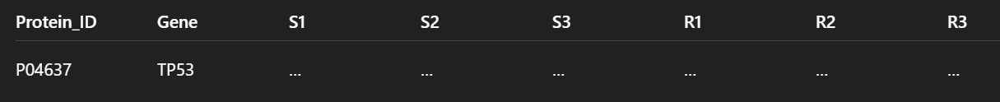

# ProtAN (Proteome ANalyzer)

ProtAN is a Python-based bioinformatics pipeline dedicated for the comparative analysis of large-scale proteomics datasets. It analyzes paired proteomics datasets and identifies the differentially expressed proteins (DEPs) mapping them onto molecular pathways thus allowing comprehensive interpretation and analysis of biologically relevant data.

## 📊 Introduction

Drug sensitivity and resistance in cancer research remains a major clinical challenge, necessitating systematic approaches to identify deregulated proteins and affected pathways.

High-throughput mass spectrometry-based Proteomics is widely used to investigate proteins and molecular mechanisms underlying drug sensitivity and resistance in cancer.

The output data from a mass spectrometer is analyzed in two parts: pre- and post-processing.

In pre-processing, the proteins in the samples are identified by aligning against a known database followed by data normalization, missing value imputation and log2- transformation. Software such as MaxQuant (DDA-based) or Perseus (DIA-based) can be used for this.

The post-processing steps include statistically identifying the dysregulated proteins and their functional role in biological networks. Downstream analysis includes protein-protein interactions, motif enrichment, peptide selection and many more.

## 💡 Motivation for the project

While working on the analysis of drug resistivity proteomics data I realized that single, unified tools are available for data pre-processing (eg. MaxQuant/ Perseus) but very few to perform robust post-processing data analysis. 

Researchers have to browse through multiple tools and software, each having their compatibility issues, different file formats and handling multiple files. This makes it cumbersome for the researchers.

Thus, ProtAN provides a reproducible, command-line–driven Python pipeline for comparative analysis of drug-sensitive vs resistant proteomics data.

This workflow assumes that the input proteomics data have already undergone missing value imputation, normalization, and log-transformation, allowing the pipeline to focus on downstream statistical analysis, functional interpretation, and network biology.

## 🔎 ProtAN Pipeline Overview

The pipeline performs the following major steps:

1. Input data parsing and validation
2. Differential expression analysis (fold change and statistical testing)
3. Data visualization (volcano plot, heatmap, PCA)
4. Pathway enrichment and functional annotation (KEGG and GO Biological Process)
5. Protein–protein interaction (PPI) network construction using STRING
6. Network-level statistics and hub identification
7. Motif enrichment analysis among deregulated proteins
8. Automated PDF and PNG report generation

All steps are executed through a single CLI tool, ensuring reproducibility and scalability to other datasets with similar structure.

## 📝 Methods

**1. Data Parsing and Quality Control**

Used of pandas to load csv or Excel files. Column names are stripped of whitespace and validated to ensure correct group assignment. Numerical columns are coerced into floating-point format to prevent downstream statistical errors.

---

**2. Differential Expression Analysis**

**Fold Change Calculation**

For each protein:
* Mean expression is calculated across biological replicates for each condition
* Log2 fold change is computed as:

  log2FC = mean(R) − mean(S)

Positive values indicate upregulation in resistant cells, while negative values indicate downregulation.

**Statistical Testing**

* A paired two-sample t-test is applied between sensitive and resistant replicates for each protein. P-values are adjusted for multiple testing using the Benjamini–Hochberg false discovery rate (FDR) method.
* Proteins are classified as significantly deregulated based on:

  Adjusted p-value threshold (default: 0.1)

  Absolute log2 fold change threshold (default: 1.5)

* Adjusting p-value and FC thresholds should be done to ensure stringency as per the dataset

---

**3. Data Visualization**

* **Volcano Plot**

  A volcano plot is generated to visualize statistical significance versus magnitude of change:

   * x-axis: log2 fold change
   * y-axis: −log10(adjusted p-value)

* **Heatmap**

  A heatmap of the DEPs is generated using hierarchical clustering, enabling visualization of expression patterns across all samples.

* **Principal Component Analysis (PCA)**

  PCA is performed on the expression matrix of significant proteins to assess global separation between sensitive and resistant samples.

---

**4. Pathway Enrichment and Functional Analysis**

**KEGG Pathway Analysis**

* KEGG pathway enrichment is performed using KEGG gene mappings and over-representation analysis.
* Pathways are ranked by enrichment significance.

**GO (Gene Ontology) Functional Annotation**

* Assigns genes or proteins to standardized biological terms describing their biological processes, molecular functions, and cellular components.

---

**5. Protein–Protein Interaction Network Analysis**

**STRING Database Integration**

* Protein–protein interactions are retrieved using the STRING API, filtered by a confidence score threshold.
* The resulting interaction network is constructed using networkx.

**Network Statistics**

The following network-level metrics are computed:

* Number of nodes and edges
* Average node degree
* Network density
* Connected components
* Degree centrality
* Highly connected hub proteins are identified as potential key regulators or therapeutic targets

---

**6. Motif Enrichment Analysis**

* Sequence motifs enriched among deregulated proteins are identified using motif-scanning outputs (e.g., MEME, FIMO, or curated motif databases).

Motifs are:

* Tested for statistical enrichment
* Annotated with known functional roles (e.g., phosphorylation sites, interaction motifs)
* Linked to potential regulatory mechanisms or protein–protein interactions

## 📝 Files to be run in the repository

1. `protan_pipeline.py`

2. `proteome-data.csv`

3. `requirements.txt`

4. `tests/test_protan_pipeline.py`


## 📥 Input data format

The pipeline is designed for paired proteomics analysis only. All input files should be paired. Users can change input file format and dataframe headers as per the dataset.

 * Standard input example taken for this pipeline-

 `.csv` file in the following format-
 
 

S1, S2, S3: drug-sensitive biological replicates

R1, R2, R3: drug-resistant biological replicates

---

Other acceptable input formats (change code accordingly)-

* `.xlsx` file 
* Paired data headers such as Control vs Tumor/ N0 vs Healthy/ Grade1 tumor vs Grade2 tumor etc.

Assumptions-
* Values are log-transformed (log2 intensity)
* Data are normalized across samples
* Missing values have been imputed prior to analysis

## 📤 Output files

    ├── proteome-data_DE_all

    ├── proteome-data_DE_sigp_log2FC.csv

    ├── volcano_DE_proteins.csv

    ├── volcano.png

    ├── heatmap_top50_DE_proteins

    ├── heatmap.png

    ├── pca.png

    ├── User desktop
    
       ├── proteomics_analysis
          ├── kegg_enrichment.csv
          
       ├── proteomics_functional
          ├── go_biological_process.csv
          ├── go_bubble_plot.png
          ├── string_ppi_network.png
          ├── string_ppi_network.pdf
          ├── string_edges.csv
          ├── string_network_stats.csv

       ├── proteomics_motifs
          ├── motif_enrichment_results.csv
          ├── motif_enrichment_bubble.png
          ├── motif_enrichment_bubble.pdf
          ├── protein_motif_counts.csv

## 🏃‍♀️ Dependencies

To install the dependencies, run:

```bash
pip install -r requirements.txt
```

Required: Python v3.14

| Package                  | Used for                             |  
| ------------             | -----------------------------        |
| pandas >=1.5             | Data loading & manipulation          |
| numpy >=1.23             | Numerical operations                 |
| scipy >=1.9              | Statistical tests                    |
| statsmodels >=0.13       | FDR correction                       |
| matplotlib >=3.6         | Volcano, PCA, heatmaps               |
| seaborn >=0.12           | Cleaner statistical plots            |
| scikit-learn >=1.2       | PCA                                  |
| networkx >=3.0           | PPI networks                         |
| requests >=2.28          | Reactome / KEGG / STRING APIs        |
| openpyxl >=3.1           | Excel input                          |
| reportlab >=4.0          | PDF report generation                |
| tqdm >=4.65              | Progress bars for APIs               |
| gseapy>=1.0              | Pathway and gene set enrichment      |
| pyyaml>=6.0              | Pipeline configuration management    |


## ▶️ Usage

To run the program in the terminal:

```bash
python protan_pipeline.py
```

This will:

1. Read your Excel or CSV file (input as `proteome-data.csv`). You can use a different file name and format (`.csv` or `.xlsx`) but change accordingly in the code.
2. Perform differential expression analysis
3. Generate plots
4. Run KEGG, GO and STRING analyses
5. Produce the output files

---

To run the tests in the terminal:

```bash
pip install pytest

pytest tests/test_protan_pipeline.py -v
```

## 📖 Dataset Used

Investigating Cisplatin Resistance in Squamous Cervical Cancer: Proteomic Insights into DNA Repair Pathways and Omics-Based Drug Repurposing

Amrita Mukherjee, Sayan Manna, Avinash Singh, Adrija Ray, and Sanjeeva Srivastava

Journal of Proteome Research 2025 24 (6), 2628-2642

[DOI:10.1021/acs.jproteome.4c00885](https://doi.org/10.1021/acs.jproteome.4c00885))

The dataset used here is Table S4.

## 💻🔨 Applicability and Extensibility

This pipeline can be applied to:

* Drug resistance models (cell lines/ tissue datasets)
* Paired cancer proteomics datasets
* Label-free or isobaric-tag–based quantitative proteomics
* Knockdown vs Wildtype
* By modifying column names and thresholds, the pipeline can be adapted to a wide range of comparative proteomics studies.

This code does not generalize-
* Paired vs unpaired design
* Column naming inconsistency
* Gene/Protein ID inconsistency

## 🔓 Summary

This pipeline provides an end-to-end, reproducible framework for integrating statistical proteomics, pathway biology, network analysis, and motif-level interpretation. It bridges wet-lab proteomics with computational systems biology, enabling mechanistic insights into drug resistance in cancer.

---

🎓 This project was written as part of the [Python course 20263071](https://github.com/Code-Maven/wis-python-course-2025-10.git) at the Weizmann Institute of Science taught by [Gábor Szabó](https://szabgab.com/).

---

❓ Let me know if you have any questions or feedback by opening an issue or contacting the project maintainer!


---
